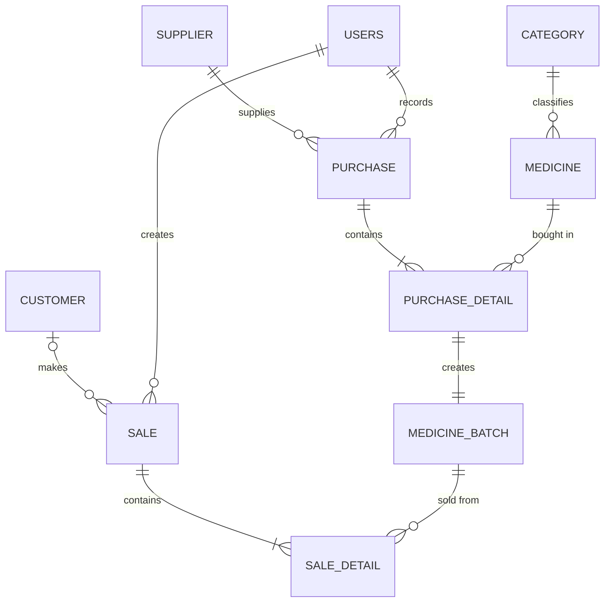

# Phase 2: Database Design

## Entities (final, after normalization corrections)
```
CATEGORY        (category_id PK, category_name UQ, description)
MEDICINE        (medicine_id PK, medicine_name, generic_name, strength, manufacturer,
                 category_id FK, unit, selling_price, reorder_level, is_active)
SUPPLIER        (supplier_id PK, supplier_name UQ, contact_person, phone, email, address)
CUSTOMER        (customer_id PK, customer_name, phone UQ, address)
USERS           (user_id PK, username UQ, password_hash, full_name, role, is_active, created_at)
PURCHASE        (purchase_id PK, supplier_id FK, user_id FK, purchase_date, invoice_no, total_amount)
PURCHASE_DETAIL (purchase_detail_id PK, purchase_id FK, medicine_id FK, quantity, purchase_price)
MEDICINE_BATCH  (batch_id PK, purchase_detail_id FK UQ, batch_no, expiry_date, quantity_remaining)
SALE            (sale_id PK, customer_id FK nullable, user_id FK, sale_date, total_amount)
SALE_DETAIL     (sale_detail_id PK, sale_id FK, batch_id FK, quantity, unit_price, discount)
```

## Relationships and cardinalities
| # | Relationship | Cardinality |
|---|---|---|
| 1 | CATEGORY - MEDICINE | 1 : M |
| 2 | SUPPLIER - PURCHASE | 1 : M |
| 3 | USERS - PURCHASE | 1 : M |
| 4 | PURCHASE - PURCHASE_DETAIL | 1 : M |
| 5 | MEDICINE - PURCHASE_DETAIL | 1 : M |
| 6 | PURCHASE_DETAIL - MEDICINE_BATCH | 1 : 1 |
| 7 | CUSTOMER - SALE | 1 : M (customer optional: walk-in) |
| 8 | USERS - SALE | 1 : M |
| 9 | SALE - SALE_DETAIL | 1 : M |
| 10 | MEDICINE_BATCH - SALE_DETAIL | 1 : M |

A batch reaches its medicine through PURCHASE_DETAIL (a view will hide this join later).

## ER diagram (paste into https://mermaid.live to render)


## Key design decisions
1. Header + detail pattern for purchases and sales.
2. Stock is never stored on MEDICINE; it is the sum of batch quantities.
3. SALE_DETAIL points to the batch, so expiry and cost are traceable.
4. Purchase price is kept per purchase line (prices change over time).
5. Customer is optional on a sale (walk-in).
6. unit_price is copied into SALE_DETAIL so old receipts never change.
