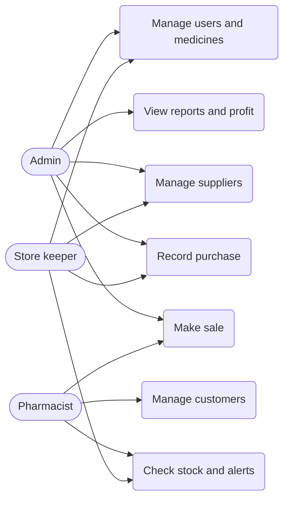

# Medical Store Inventory Management System: Project Report (outline with content)

## 1. Introduction
A database-driven system for a pharmacy that records purchases and sales, tracks stock per batch with
expiry dates, raises low-stock and expiry alerts, and produces sales, purchase and profit reports.
Built on Oracle Database (SQL, PL/SQL) with a PHP web front end.

## 2. Problem Statement
Manual or spreadsheet stock keeping causes wrong stock counts, sale of expired medicines, stock-outs of
fast-selling items, and no quick answer to "how much did we sell or earn this month?".

## 3. Objectives
- Store medicines, suppliers, customers, users, purchases and sales reliably (3NF, constraints).
- Track stock per batch and sell the earliest-expiring batch first (FEFO).
- Block overselling and the sale of expired medicines automatically.
- Alert about low stock, expired and near-expiry batches (30 and 60 days).
- Provide reports: inventory, sales (daily/monthly), purchases, best sellers, profit.

## 4. Scope
In scope: inventory, purchasing, sales (POS), customers, suppliers, role-based login, reports, dashboard.
Out of scope: online payments, barcode scanners, accounting ledger, multi-branch support, returns to supplier.

## 5. Functional Requirements
See docs/01_requirements.md (FR-1 to FR-11).

## 6. Non-Functional Requirements
Data integrity, accuracy (transactions), security (roles, hashed passwords), performance (indexes),
reliability (rollback), maintainability (3NF, naming), usability, scalability, auditability.

## 7. Use Case Diagram (paste into https://mermaid.live)

## 8. ER Diagram
See docs/02_database_design.md (Mermaid ER diagram, 10 entities, 10 relationships).

## 9. Database Schema
See docs/03_normalization.md (final 3NF schema) and sql/02_create_tables.sql.

## 10. Normalization
See docs/03_normalization.md: unnormalized sheet, 1NF, 2NF, 3NF, the PURCHASE_DETAIL / MEDICINE_BATCH
correction, and two documented exceptions (total_amount, unit_price).

## 11. SQL Queries and Advanced Features
- sql/06_queries.sql: 16 queries (JOIN, GROUP BY, HAVING, subquery, FETCH FIRST).
- sql/07_views_functions.sql: 6 views, 2 functions.
- sql/08_procedures_triggers.sql: 5 procedures, 2 triggers, transactions (COMMIT/ROLLBACK).

## 12. Screenshots and Testing
Take screenshots of: login, dashboard, medicines, purchase form, POS, receipt, inventory, alerts, reports.
Testing evidence: sql/05_tests.sql (data checks) and sql/09_phase7_tests.sql (13 tests). Results obtained:
all objects VALID; stock, totals and integrity checks returned no mismatches; overselling, expired sale and
expired purchase were rejected with ORA-20006, ORA-20011, ORA-20010; ROLLBACK and cancel restored stock.

| Test | Expected | Result |
|---|---|---|
| Sell 500 Panadol | Rejected, nothing saved | Passed |
| Sell expired batch | Rejected by trigger | Passed |
| Sale uses 2 batches (FEFO) | B101 then B102 | Passed |
| ROLLBACK | Stock restored | Passed |

## 13. Conclusion
The system keeps stock accurate per batch, prevents sales of expired or unavailable medicine, and gives
the owner instant reports, using constraints, views, procedures, triggers and transactions in Oracle.

## 14. Future Enhancements
Barcode scanning, SMS/WhatsApp expiry alerts, returns and supplier credit notes, multi-branch inventory,
salted password hashing with user management screen, CSRF protection, automatic reorder suggestions,
mobile app, backup and audit log tables.
